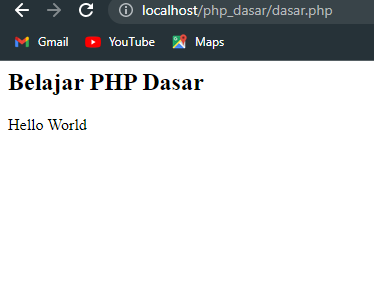

<body>
    <table border="1">
        <tr>
            <th> Nama</th>
            <th>NIM</th>
            <th>Kelas</th>
        </tr>
        <tr>
            <td>Ihsan Nurul Alam</td>
            <td>312110162</td>
            <td>TI.21.A.1</td>
        </tr>
    </table>
</body>

# Tugas Pratikum 02
### Penjelasan

### Pengenalan PHP
- Buat file dengan akhiran (.php)<p>
```bash
    <h2>Belajar PHP Dasar</h2>
    <?php
    echo "Hello World";
    ?>
```

- hasil 

### Menggunakan Variable
- variable.
```bash
    <h2>Menggunakan Variable</h2>
    <?php
    $nim = "312110162";
    $nama = 'Ihsan Nurul Alam';
    echo "NIM : ". $nim . "<br>";
    echo "Nama : $nama";
    ?>
```
- nya  


### Predifine Varible
-  Predifine Varible. 
```bash
    <h2>Predifine Variable</h2>
    <?php
    echo 'Selamat Datang '. $_GET['nama'];
    ?>
```
- hasil  

- untuk hasil diatas bisa di akses degan link seperti berikut http://localhost/pw2-03/dasar_php.php?nama=Ihsan

### Form Input
-  Form Input.
```bash
    <h2>Form Input</h2>
    <form method="post">
        <label for="">Nama: </label>
        <input type="text" name="nama">
        <input type="submit" value="kirim">
    </form>
    <?php
    echo 'Selamat Datang ' . $_POST['nama'];
    ?>
```
- hasil 

- untuk memunculkan hasil nama isi terhbih dahulu kolom formulirnya


### Operator
- Operator. 
```bash
    <h2>Operator</h2>
    <?php
    $gaji = 1000000;
    $pajak = 0.1;
    $thp = $gaji - ($gaji*$pajak);
    echo "Gaji sebelum pajak = Rp. $gaji <br>";
    echo "Gaji yang dibawa pulang = Rp. $thp";
    ?>
```
- hasil  


### IF
-  IF. 
```bash
    <h2>Kondisi IF</h2>
    <?php
    $nama_hari = date("1");
    if ($nama_hari == "Sunday"){
        echo "Minggu";
    }
    elseif ($nama_hari == "Monday"){
        echo "Senin";
    }
    else{
        echo "Selasa";
    }
    ?>
```
-  hasil 


### Switch
-  Switch. 
```bash
    <h2>Kondisi Switch</h2>
    <?php
    $nama_hari = date("1");
    switch ($nama_hari){
        case "Sunday":
            echo "Minggu";
            break;
        case "Monday":
            echo "Senin";
            break;
        case "Tuesday":
            echo "Selasa";
            break;
        default:
            echo "Sabtu";
    }?>
```
-  hasil  


### Perulangan For
- For. 
```bash
    <h2>Perulangan For</h2>
    <?php
    echo "Perulangan 1 sampai 10 <br/>";
    for ($i=1; $i<=10; $i++){
        echo "Perulangan ke: ".$i.'<br/>';
    }
    
    echo "Perulangan Menurun dari 10 ke 1 <br/>";
    for ($i=10; $i>=1; $i--){
        echo "Perulangan ke: ".$i.'<br/>';
    }
    ?>
```
- hasil 


### Perulangan While
- While. 
```bash
    <h2>Perulangan While</h2>
    <?php
    echo "Perulangan 1 sampai 10 <br/>";
    $i=1;
    while ($i<=10){
        echo "Perulangan ke: ".$i.'<br/>';
        $i++;
    }
    ?>
```
- hasil 


### Perulangan dowhile
-  dowhile. 
```bash
    <h2>Perulangan dowhile</h2>
    <?php
    echo "Perulangan 1 sampai 10 <br/>";
    $i=1;
    do{
        echo "Perulangan ke: ".$i.'<br/>';
        $i++;
    }
    while($i<=10);
    ?>
```
- hasil 


# END
